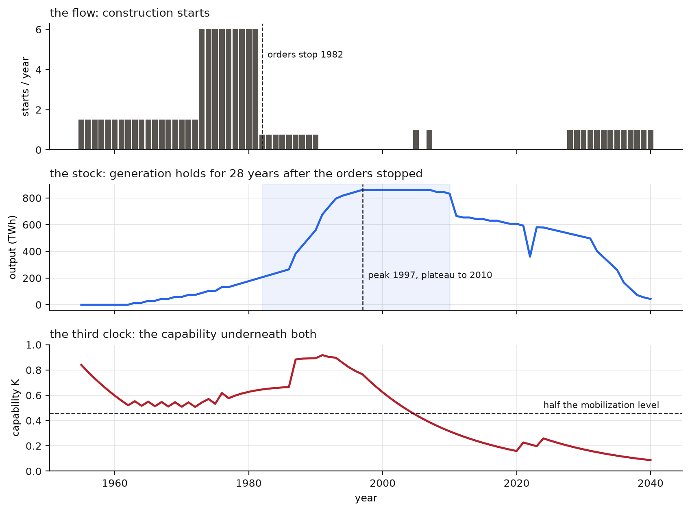
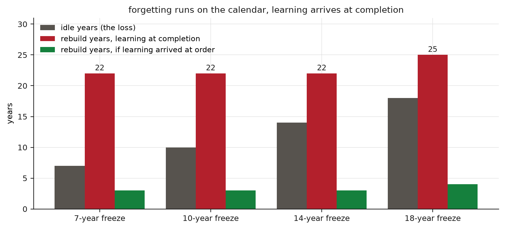
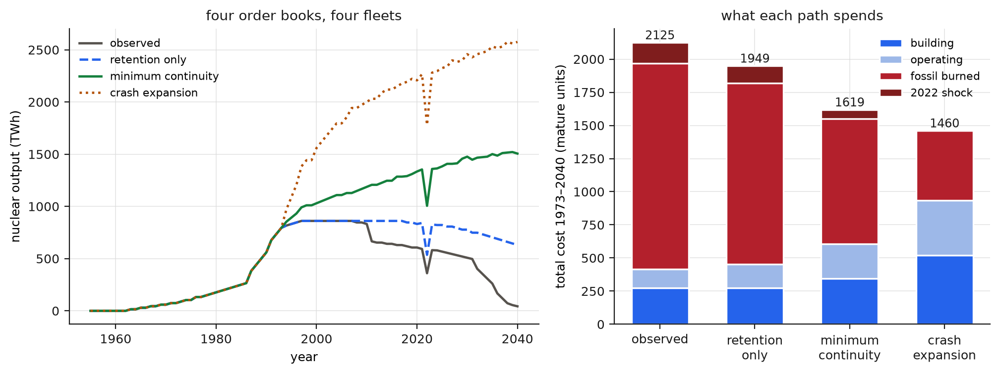
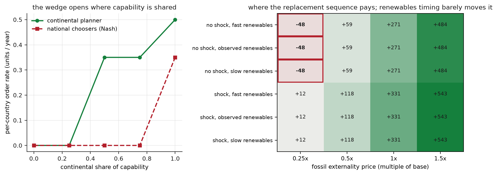

## Abstract

Between the oil shock of 1973 and the gas shock of 2022, Western Europe built the world's largest fleet of low-carbon power plants, stopped building it, lost the ability to build economically, and then read the price of that loss as a property of the technology. This paper treats the retreat as an industrial-capability event. It makes four claims, in descending order of evidential support. The retreat began before Chernobyl: construction starts collapsed between 1979 and 1983, and the April 1986 accident converted an investment slowdown into political lock-in it did not initiate. Stopping was five processes on five clocks, order stop, construction stop, capability stop, asset stop, output decline, and the operating fleet concealed the death of the order pipeline for two decades: EU nuclear output peaked at 928 TWh in 2004, long after Western orders had ceased. The capability loss was hysteretic: the first projects of the 2005 restart arrived at roughly 4 times their original estimates, took over seventeen years to build, and were received as proof that reactors cannot be built rather than as the measured cost of the interruption that preceded them. And underneath the national decisions sat a coordination failure: reactor construction anywhere in Europe maintained suppliers, skills, and regulatory competence everywhere, while every decision to order or cancel was national. A deterministic model of a reactor-building system, calibrated to the documented fourteen-year construction-start hiatus, the fourfold restart premium, and the 15% series effect, reproduces the record's shape and prices its counterfactuals. Output holds its peak for 28 years after orders stop while the capability underneath falls to a third of its mobilization level. A cost-reading policymaker recovers from an order freeze of up to 7 years and locks permanently beyond it; tolerating triple cost moves the threshold to 13 years. The hiatus Europe took was 14. Every restart probe launched from inside the trap prices at 4 to 6 times the series cost and so confirms the stop that caused it. Fourteen idle years take 22 building years to undo, because forgetting runs on the calendar while learning arrives only at completion. Against the observed path, retaining the closed reactors saves 8% of total system cost; retaining them and holding a two-unit-a-year replacement sequence saves 24%, keeps the 2022 exposure at less than half, and leaves the option to build at 1.6 times series cost instead of 5.8. The advantage survives 21 of 24 regimes and fails only where fossil externalities are priced near zero and the crisis never comes. The lesson is about capabilities, and it generalizes: a civilization should not let a difficult-to-reconstruct capability decay while the problems it answers remain, because the decay is self-concealing while it happens and self-justifying once it is priced.

## From one shock to the other

In October 1973 the price of imported oil quadrupled and Western Europe discovered what its energy system depended on. Within a decade France had ordered more than fifty reactors, and the continent's utilities, vendors, and regulators had assembled the largest low-carbon construction programme in the history of electricity. In February 2022 Russia invaded Ukraine, and Europe discovered its dependence a second time: 155 bcm of Russian gas in the preceding year, around 45% of its gas imports and almost 40% of its consumption (International Energy Agency, 2022). Between the two shocks lies the subject of this paper, a half-century in which Europe first built a strategic capability against this exposure and then, slowly and mostly invisibly, dismantled it.

The dismantling is usually told as a story about reactors: how many were closed, how many were never built. This paper tells it as a story about the ability to build. That ability, the trained welders and the qualified forgings, the design teams and the owner-engineers, the regulators who remember how to license new construction, is a stock that decays when idle and regenerates only through use. Once the retreat is read at the level of this stock, its chronology, its invisibility, its price, and its self-justification all follow from one mechanism.

Four claims, in descending order of evidential support. The retreat predates Chernobyl, so the accident ratified a collapse it did not cause. Stopping was five distinct processes on five clocks, and the slowest of them, output, concealed the fastest, capability, for two decades. The loss was hysteretic: reversing the policy did not reverse the effect, and the price of the failed reversal was then read as evidence for the policy. And beneath the national decisions sat a coordination failure that no national actor had an incentive to correct.

The paper defends one counterfactual and rejects three. Defended: a minimum-continuity Europe that retains reactors its regulators judge safe while fossil generation remains, and holds a slow standardized replacement sequence, about two units a year continent-wide, alongside the renewable expansion that actually occurred. Rejected: an all-nuclear Europe, a Europe that diverted its renewable investment into reactors, and the claim that any nuclear policy would have prevented the 2022 crisis.

## The retreat began before the accident

Chernobyl is the visible breakpoint, and it is the wrong causal origin. A construction start records decisions, financing, design, and procurement undertaken years earlier, and the Western European start series was nearly empty three years before the accident. Western starts had collapsed by 1983; between the start of Civaux-2 in April 1991 and the start of Olkiluoto-3 in August 2005 there were none at all (International Atomic Energy Agency, 2023).

The forces that emptied the pipeline were in place by the late 1970s. Electricity-demand projections built in the growth years failed as industrial growth slowed and energy intensity fell, so planned capacity lost its urgency. Construction costs and schedules deteriorated for reasons that were real and internal to the industry: design change during construction, licensing conflict, inflation and high interest rates on a capital structure dominated by construction-period spending. And public authorization failed in country after country before 1986: Austria's 1978 referendum stranded the completed Zwentendorf plant, Sweden's 1980 referendum imposed a phase-out ceiling on a fleet that kept operating, Spain's 1983 moratorium cancelled units in mid-construction (Müller and Thurner, 2017). Italy's 1987 referendum, the one clearly downstream of Chernobyl, ended a programme already contracting.

What the accident supplied was lock-in. Before 1986 nuclear risk could be argued plant by plant and government by government. A reactor in one jurisdiction irradiating the milk of another turned it into a transnational political fact, strengthened every anti-nuclear coalition, and raised the cost of any restart proposal for a generation. The distinction matters because the two readings assign the loss differently. If Chernobyl caused the retreat, the retreat was an exogenous shock and there was nothing to defend against. If the pipeline was already dead, the accident hardened a choice that was being made on economics and politics, and the capability consequences of that choice were assessable at the time.

## Five stops and one illusion

Stopping was five processes, and they ran on different clocks. Orders stopped first: the flow of new commitments fell below replacement in the early 1980s. Construction stopped next, when the in-flight pipeline drained: the last pre-hiatus completions were the N4 units around the turn of the millennium. Capability stopped invisibly and throughout: teams dispersed, suppliers let nuclear certifications lapse, regulators reorganized around operating plants, utilities lost the organizational knowledge of being a demanding customer for a reactor. Assets stopped last and by decision: after Fukushima, Germany closed more than half its capacity within months and the rest by 2023. Output declined slowest of all: EU nuclear generation kept rising to a peak of 928 TWh in 2004 and had fallen 29% by 2024, to just under 650 TWh, or 23.3% of EU electricity (Eurostat, 2025).

The gap between the first clock and the last is the illusion that hid the retreat. A policymaker in 1995 looked at a fleet producing at record levels and saw a healthy nuclear sector. The fleet was a stock, accumulated by the orders of 1970–1985; the orders were the flow, and the flow was dead. An industry can look like this for twenty years, a factory at record output with no apprentices on the floor, and the damage becomes visible only when someone tries to build again.

## The restart that priced the interruption

Someone tried in 2005. Olkiluoto-3 was contracted at €3.2 billion for operation in 2009; it connected to the grid in 2022, and by 2017 was already €5.3 billion over budget (National Audit Office, 2017). Flamanville-3, started in 2007, reached a total construction cost around €23.7 billion in 2023 euros including interest, with expected profitability below its owner's cost of capital (Cour des comptes, 2025). The UK's auditors, looking back from 2026, put it in one sentence: the French and Finnish projects experienced delays of more than a decade and cost four times their original estimates (National Audit Office, 2026).

The Finnish regulator's own account of why is the plainest document in the record: construction "started after a long break in nuclear power plant construction in Europe, which had resulted in loss of experienced and qualified engineering and manufacturing resources," compounded by suppliers unfamiliar with the regulatory framework and a design incomplete at first concrete (Radiation and Nuclear Safety Authority, 2019). This is a description of a decayed capability stock, written by the institution that watched the decay arrive on site.

The interruption is one cause among several, and treating it as the only one would make the argument unfalsifiable. The EPR was a new and unusually complex design; the contracting was adversarial; the engineering was unfinished when construction began. All of that is true. What the record supports is narrower: a first-of-a-kind penalty that the industry's own analyses price, about 15% saved on the second unit of a pair and another 5% on the second pair, with design completion at construction start among the strongest cost determinants (Nuclear Energy Agency, 2020), landed on a continent that had converted every project into a first of a kind by building nothing for fourteen years. The econometric literature points the same way: lead times and cost outcomes vary strongly with construction regime and continuity, and follow no universal escalation law (Berthélemy and Escobar Rangel, 2015; Lovering, Yip and Nordhaus, 2016; Koomey, Hultman and Grubler, 2017). Even the French programme's escalation, the strongest case for cost growth inside a standardized series (Grubler, 2010), softens on reanalysis of the utility's own accounts (Escobar Rangel and Lévêque, 2015).

The restart prices were read as timeless properties of fission. Nuclear power was now the technology that costs €23 billion a unit, and the interruption that had produced the number disappeared from the sentence. Stopping had made restarting expensive, and expensive restarting proved that stopping had been right.

## Closing plants before coal

The asset stop has cleaner evidence than any other part of the record, because Germany ran the experiment. After 2011 it shut more than half its nuclear capacity while substantial coal generation remained on its grid. The lost output, 57.6 TWh a year against the no-phase-out counterfactual, was replaced by 16.7 TWh of hard coal, 7.6 of lignite, 4.9 of gas, 10.6 of net imports, and 16.5 of additional wind and solar (Jarvis, Deschenes and Jha, 2022). Renewables covered less than a third of the gap. Fossil and imports covered the rest. The same study prices the consequences: 26.2 Mt of additional CO2 a year, roughly 800 additional deaths a year from local air pollution, and a social cost of €3 to €8 billion a year, most of it mortality. The authors' comparison is the one that matters for policy: a decision-maker would need to assign implausibly high costs to nuclear accident risk and waste for the phase-out to net out positive.

The German case establishes a sequencing principle rather than a nuclear-forever principle. Low-carbon assets should leave the system after the higher-emission assets they hold out, and Germany retired them in the reverse order. Nothing in the principle requires any reactor to run beyond what its regulator certifies; several Eastern European closures during EU accession were safety judgments about early Soviet designs and belong outside the error entirely. The error is specific: closing certified low-carbon capacity while coal still burned beside it.

## The year the bill arrived

2022 stress-tested every part of the structure at once, and it did not spare the nuclear side. The gas dependence is quantified above. The French fleet, the largest concentration of the mobilization era's building, spent the crisis year at 54% availability against a 2015–2019 average of 73%, produced 279 TWh, 81.7 TWh below the previous year, and made France a net electricity importer for the first time since 1980 (Réseau de Transport d'Électricité, 2023). Stress-corrosion cracking discovered in late 2021 propagated through sister units of the same design generations, and maintenance postponed through the pandemic came due in the same window. A fleet built in one burst ages in one burst. Its faults arrive together.

The fuel cycle carried its own residual dependence: for the Russian-designed VVER reactors in operation across five member states, no alternative fuel had been licensed when the war began (Euratom Supply Agency, 2023). Nuclear dependence differs from gas dependence in kind, fuel is storable, its cost share is small, and suppliers can be qualified given years, and it is dependence nonetheless.

So the year the continuity argument should have been vindicated is also the year that disciplines it. More reactors of the same vintage, built in the same burst, would have shared the same outage. What the crisis rewards is the thing Europe specifically lacked: a fleet with staggered vintages and a live construction system behind it. That is an argument for continuity rather than for capacity.

## A model of a building system

The mechanism claimed so far, a capability stock that decays invisibly, prices its own restart, and converts that price into justification, is simple enough to build. The rest of the paper works with a deterministic model of a continental reactor-building system, and every number from here on is a fact about the model's geometry unless it carries a citation. The model's TWh are not Europe's TWh; the model exists to show what the mechanism does, under assumptions stated plainly, and where it fails.

One capability stock K between 0 and 1 stands for everything the record describes losing. It obeys two clocks. Forgetting runs on the calendar: K decays by 6.6% in every idle year, a rate with a microfoundation in the organizational-forgetting literature, where production experience measurably depreciates on interrupted lines (Argote and Epple, 1990; Benkard, 2000). Learning arrives at completion: K rises only when a unit is finished, the learning-by-doing term (Arrow, 1962) lagged by the build. The cost of a unit rises exponentially as capability falls, normalized to 1 at the mature programme; the time to build rises the same way, from 6 years at maturity to 17.1 at the bottom of the observed decay.

Two documented magnitudes calibrate the two rates. The construction-start hiatus, April 1991 to August 2005, is counted as fourteen idle years, and the decay rate is set so that fourteen idle years price the next unit at 4 times the series cost, the auditors' multiple for the projects that ended the hiatus. The learning rate is set so that one completion at that decayed level cuts the next unit's cost by 15%, the industry's pair effect. Both anchors are stated magnitudes, and calibration here is anchoring: the model is disciplined by the record, and none of its outputs is an econometric estimate. Its hysteresis concept is borrowed from economics, where reversing a policy famously fails to reverse its effects on unemployment and on sunk investment (Blanchard and Summers, 1986; Dixit, 1992); the transplant to industrial capability is made on the record above.

Around the stock sits a stylized continent: logistic demand, constant hydro, a renewables curve reaching its observed scale in the 2010s, a fleet that generates until retirement, and fossil generation absorbing whatever demand remains. Money is measured in mature-programme units. Fossil generation carries an all-in cost of fuel, carbon, and health of about €60 per MWh; 2022 arrives as a two-year price shock on whatever fossil generation each scenario still needs, and a common-mode fault takes half of the largest ten-year vintage cohort offline for the first shock year, which is the French lesson built into the accounting. Orders above three units a year pay a congestion premium, since a continent ordering in bursts bids up its own bottlenecks. The model is deterministic; a rerun reproduces every number bit for bit.

{width=100%}

## The two clocks and the illusion

Fed the observed order book, early builds, mobilization at six starts a year through 1981, collapse to a trickle, nothing through the hiatus, two probes in 2005 and 2007, the model reproduces the record's shape without being fitted to it. Orders stop in 1982. Output peaks 15 years later and stays within 5% of peak until 2010, an illusion window of 28 years in which the flow is dead and the stock cannot show it. At the output peak, capability has already fallen to 0.83 of its mobilization level; by the end of the plateau it stands at 0.34. The model's own restart probe in 2005 prices at 3.1 rather than the calibrated 4.0, and the gap is instructive: the record's restart carried a design-novelty penalty on top of the interruption penalty, and the model prices only the second.

The asymmetry between losing and rebuilding follows from the two clocks alone. Take the mature programme, freeze it for fourteen years, then assume the political constraint away: someone resumes ordering at full mobilization rate and pays whatever units cost. Capability returns to within 10% of the mature price after 22 years of building. Seven idle years also take 22 building years to undo, and eighteen take 25, because recovery time is dominated by the first completion cycle, whose length the decay itself set. Move the learning to order time instead of completion time, leaving every other parameter fixed, and recovery takes 3 years. The completion lag is the entire asymmetry: forgetting starts the day orders stop, while the learning that would repair it waits on the first slow, expensive unit.

{width=100%}

## The ratchet and the trap

The recovery just described assumed a payer of last resort. Replace it with the chooser Europe actually had: one who orders the replacement rate whenever the engineering estimate for a new unit, priced off current capability with the industry's documented optimism, comes in under a cost tolerance, and who otherwise launches an exploratory unit every eight years to test whether building has become reasonable again. A decision to build commits a ten-year programme, which is how real programmes survive the completion lag their own restart creates.

Under this chooser the system is a ratchet. Freeze orders for up to 7 years and the programme restarts itself and recovers. Freeze them longer and it locks: capability decays past the point where any estimate clears the tolerance, and the state is permanent. The threshold moves with the tolerance, from 1 year for a chooser who insists on 1.2 times the series price up to 13 years for one who would tolerate triple cost. The hiatus Europe took was fourteen. On this model, by 2005 there was no cost tolerance short of the crash-programme level at which a cost-reading chooser would restart, which is the formal content of calling 1986 a ratchet: the freeze did not need to cause the collapse, it only needed to outlast the critical duration, and it outlasted every critical duration in the grid.

The trap has one more property, and it is the one the record's last twenty years keep exhibiting. Probes launched from inside the locked state price at 4.2 on the first attempt and settle near 6 as decay continues between probes: every exploratory project a locked system undertakes is launched at the capability the lock created, so every probe returns confirming evidence. Within the model no single project can disconfirm the stop, because any project cheap enough to disconfirm it would require the capability whose absence is the thing being tested. Escape is a committed programme through the penalty; a probe is structurally incapable of it. Olkiluoto-3 and Flamanville-3 were probes.

{width=100%}

## A capability with no chooser

The chooser above is a fiction in one more way: Europe had no such actor. Build decisions were national; the capability was continental. Euratom was founded in 1957 to develop nuclear industry at community scale, and member states kept the decisions that sustain such an industry for themselves, which socialized the risk of any reactor while leaving the continuity of the system to fragmented national choice. A French order kept component suppliers qualified for a Belgian project; a Swedish cancellation thinned the market every other buyer depended on. Nobody's ledger carried the externality.

The model prices this. Eight identical countries choose order rates; capability has a national component and a continental one, and a spillover share fixes the weight of each. When capability is purely national, the planner and the national choosers agree, and what they agree on is zero: at one country's scale, a replacement sequence cannot complete units often enough to hold its own capability against the calendar, so even a welfare-maximizing national planner declines to build. When the continental share reaches one half, a continental planner orders 2.8 units a year across the system while the equilibrium of national choosers stays at zero, and the wedge persists across the shared-capability range. Continuity was affordable at continental scale and unaffordable at national scale, and the scale at which it was affordable had no one entitled to choose it. Europe had nuclear policies in abundance, one per member state. The object that needed a policy existed only at the level where no chooser did.

## Four order books

Four scenarios share the model's history to 1981 and diverge at the point where Europe's choices diverged. Observed follows the record: collapse, hiatus, probes, a 2011-style closure of a fifth of the fleet, retirement at 45 years. Retention only differs by keeping the closed reactors and extending lives, with the same dead order book. Minimum continuity adds the replacement sequence, a floor of two starts a year from 1982, and keeps the extensions. Crash expansion keeps ordering at mobilization rate until 2000 and at half that afterward.

Over 1973–2040 the totals separate cleanly. The observed path costs 2125 units: 275 of building, 1555 of fossil burning at base externality prices, and 155 of 2022 shock. Retention alone saves 176, about 8%, for no additional building. Minimum continuity costs 69 more units of building than retention, avoids 21,215 TWh of fossil generation, roughly halves the shock exposure, and lands at 1619, a 24% saving on the observed path. Its fleet enters 2022 with staggered vintages, so the common-mode fault costs it a quarter of output against the observed path's 39%, and its next unit in 2023 prices at 1.6 against the observed 5.8. That last pair of numbers is the option value of continuity stated as a price: both worlds face the same 2022, and one of them can still answer it with construction.

Crash expansion complicates the ranking. At base externality prices it is the cheapest path of the four, 1460, because from 1973 to the renewables era its larger fleet displaces enormous fossil generation; it also curtails about 17,000 TWh of its own output once renewables arrive, and it concentrates vintages almost as badly as the observed path. Its advantage over continuity appears only when fossil externalities are priced at three quarters of base or above, and evaporates below; continuity's advantage over retention survives to a quarter of base. The model prices social cost and nothing else, no financing constraint, no siting limit, no political feasibility, so what it can say is this: the case for the replacement sequence is robust across the externality range, and the case for crash building is a bet on the externality price. The rejected counterfactuals stay rejected on the evidence the model does not contain, beginning with the IPCC's cost record for the alternatives, unit costs of solar down 85%, wind 55%, batteries 85% across 2010–2019 (Intergovernmental Panel on Climate Change, 2022), which any reactor programme claiming renewable investment would have had to outbid.

{width=100%}

## Where the argument fails

The continuity claim was swept across 24 regimes: the 2022 shock on or off, renewables arriving early or late, fossil externalities priced from a quarter of base to one and a half times. The replacement sequence beats retention in 21. All three failures sit in one corner: externalities at a quarter of base and no crisis ever arriving. In that world, fossil generation is nearly free of consequence and insurance against a shock that never comes is a dead-weight cost, so a Europe that stopped building lost little. The retreat was approximately rational in a world without climate damage, without air-pollution mortality, and without geopolitics. That is the world the decision-makers of the 1990s were implicitly pricing, and it is not the world that arrived.

The renewables axis moves almost nothing. The continuity advantage varies by under 1% between early and late renewable arrival, because in every scenario renewables displace the same fossil residual. The argument between nuclear continuity and renewable speed, the argument that consumed the policy debate, is nearly orthogonal to the question of whether the building system should have been kept alive.

The model has seams. It prices no design novelty, which is why its 2005 restart comes in at 3.1 against the record's 4. It prices congestion crudely and financing not at all; its common-mode fault lasts one year, where the French inspections ran longer; the freeze convention counts the hiatus as fully idle although a construction trickle persisted into the 1990s, so its decay rate is a floor on the true one. And the one-dimensional stock is a deliberate simplification of a loss that was compositional, since a welder, a forging line, and a licensing branch do not decay at one rate. Each seam either biases the model against the interruption penalty or leaves the penalty understated; none of them manufactures it.

{width=100%}

## The counterfactual and the claim

What was available, on the record and in the model, was minimum continuity: retain what independent regulators certify while coal and unabated gas remain in the system, replace retirements on a slow standardized sequence at continental scale, expand renewables at the pace they actually achieved, and retire generation in the order of its damage. None of this requires foresight about 2022. It requires treating the ability to build as what the model says it is, a stock with an option value, insured by the small premium of a live order book, and it requires an owner for the continental capability that the national ledgers were each free to neglect.

The claims should be kept to their evidence. That closing certified low-carbon plants before coal raised emissions, deaths, and cost is measured, in the German record, at the study level (Jarvis, Deschenes and Jha, 2022). That the retreat predates Chernobyl is chronology (International Atomic Energy Agency, 2023). That the interruption contributed materially to the restart penalty is the regulator's own finding plus the industry's own series arithmetic, with the magnitude uncertain and the mechanism not seriously in dispute (Radiation and Nuclear Safety Authority, 2019; Nuclear Energy Agency, 2020). That a replacement sequence would have paid is the model's claim, robust across its regimes and conditional on its stated prices. That Europe should have built a French-scale programme everywhere is a bet the model prices as fragile, and the paper does not make it. Sober assessments of nuclear economics before Fukushima already found the private case marginal (Davis, 2012); nothing here contradicts them, because the argument was never that reactors were privately cheap. It is that the capability to build them was socially cheap to keep and ruinous to lose.

The general form is the lesson. Capabilities of this kind, serial, physical, regulated, tacit, are stocks whose decay is concealed by the assets they leave behind and whose loss is priced only at the failed restart, at which point the price reads as a verdict on the capability rather than on its abandonment. The trap closes in fourteen years and takes a generation to reopen, when it reopens at all. Europe ran the experiment once, between one energy shock and the next, and paid for the answer. A civilization holding a difficult capability against a problem that has not yet gone away should count the cost of stopping before it stops, because afterward every number it consults will tell it that stopping was right.

## Reproducibility

The simulation, its five figures, and every model number quoted above regenerate from one command in the paper's repository (`simulation/run_all.py`; deterministic, no sampled randomness). Eighteen invariants, among them the two calibration anchors, the ratchet's existence and monotonicity, the self-confirmation of every probe launched inside the trap, the completion-lag mechanism check, and the failure of the thesis in the stated corner of the regime grid, fail the run loudly if broken. Historical quantities carry citations to the verified record and are listed beside the model outputs in `results.json`, marked as quoted rather than computed.

## References

Argote, L., and Epple, D. (1990). Learning curves in manufacturing. *Science*, 247(4945), 920--924.

Arrow, K. J. (1962). The economic implications of learning by doing. *The Review of Economic Studies*, 29(3), 155--173.

Benkard, C. L. (2000). Learning and forgetting: the dynamics of aircraft production. *American Economic Review*, 90(4), 1034--1054.

Berthélemy, M., and Escobar Rangel, L. (2015). Nuclear reactors' construction costs: the role of lead-time, standardization and technological progress. *Energy Policy*, 82, 118--130.

Blanchard, O. J., and Summers, L. H. (1986). Hysteresis and the European unemployment problem. *NBER Macroeconomics Annual*, 1, 15--78.

Cour des comptes (2025). *The EPR Sector*. Summary of the thematic public report, January 2025. Paris: Cour des comptes.

Davis, L. W. (2012). Prospects for nuclear power. *Journal of Economic Perspectives*, 26(1), 49--66.

Dixit, A. (1992). Investment and hysteresis. *Journal of Economic Perspectives*, 6(1), 107--132.

Escobar Rangel, L., and Lévêque, F. (2015). Revisiting the cost escalation curse of nuclear power: new lessons from the French experience. *Economics of Energy and Environmental Policy*, 4(2).

Euratom Supply Agency (2023). *Annual Report 2022*. Luxembourg: Publications Office of the European Union.

Eurostat (2025). Nuclear energy statistics. *Statistics Explained*. Luxembourg: European Commission.

Grubler, A. (2010). The costs of the French nuclear scale-up: a case of negative learning by doing. *Energy Policy*, 38(9), 5174--5188.

Intergovernmental Panel on Climate Change (2022). Summary for policymakers. In *Climate Change 2022: Mitigation of Climate Change. Contribution of Working Group III to the Sixth Assessment Report*. Cambridge: Cambridge University Press.

International Atomic Energy Agency (2023). *Nuclear Power Reactors in the World*. Reference Data Series No. 2, 2023 edition. Vienna: IAEA.

International Energy Agency (2022). *A 10-Point Plan to Reduce the European Union's Reliance on Russian Natural Gas*. Paris: IEA.

Jarvis, S., Deschenes, O., and Jha, A. (2022). The private and external costs of Germany's nuclear phase-out. *Journal of the European Economic Association*, 20(3), 1311--1346.

Koomey, J., Hultman, N. E., and Grubler, A. (2017). A reply to "Historical construction costs of global nuclear power reactors". *Energy Policy*, 102, 640--643.

Lovering, J. R., Yip, A., and Nordhaus, T. (2016). Historical construction costs of global nuclear power reactors. *Energy Policy*, 91, 371--382.

Müller, W. C., and Thurner, P. W., eds (2017). *The Politics of Nuclear Energy in Western Europe*. Oxford: Oxford University Press.

National Audit Office (2017). *Hinkley Point C*. HC 40, Session 2017--2019. London: NAO.

National Audit Office (2026). *Sizewell C*. HC 33, Session 2026--27. London: NAO.

Nuclear Energy Agency (2020). *Unlocking Reductions in the Construction Costs of Nuclear: A Practical Guide for Stakeholders*. NEA No. 7530. Paris: OECD NEA.

Radiation and Nuclear Safety Authority (2019). *Finnish National Report as Referred to in Article 5 of the Convention on Nuclear Safety*. 8th Review Meeting, STUK-B 237. Helsinki: STUK.

Réseau de Transport d'Électricité (2023). *Electricity Report 2022*. Key findings. Paris: RTE.
